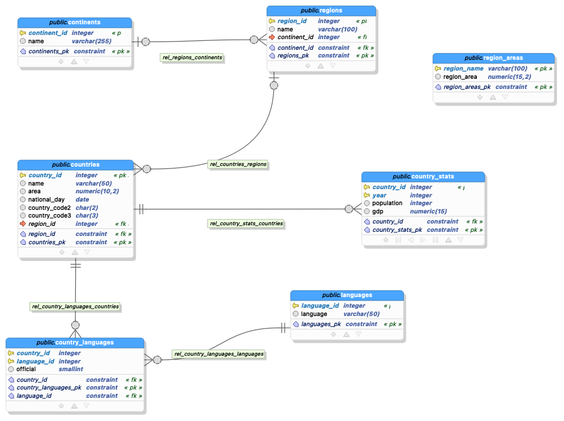
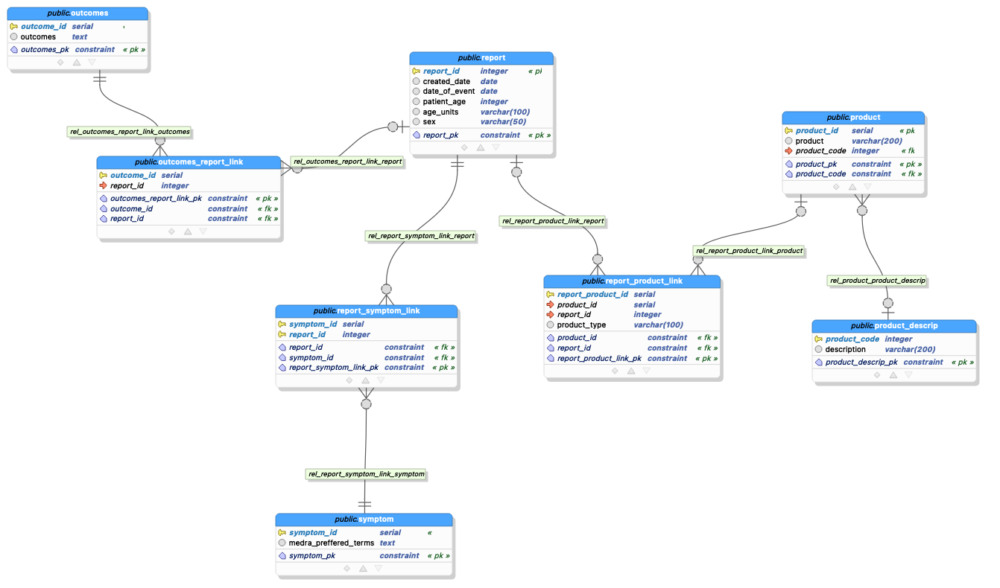

## Part 1: Create an ER Diagram by inspecting tables

* Describe the kind of relationship between each table (for example: some_table has a one to many relationship with another_table)
* Why you think this kind of relationship exists (for example: … this relationship exists because of a foreign key in some_table that references another_table)

1. The relationship between continents and regions is one-to-many because there is a foreign key in regions table that references continents
2. The relationship between regions and countries is one-to-many because there is a foreign key in countries table that references regions
3. The relationship between countries and country_stats is one-to-many because there is a foreign key in country_stats table that references countries
4. The relationship between countries and languages is many-to-many because there are foreign keys(country_id, language_id) in a third link table called country_languages 
5. The country_languages table is the link table between countries and languages tables because it contains foreign keys(country_id, language_id)
6. The region_areas table does not form any relationship with other tables

## Part 2: Run Queries

## [Link to Part 2 Queries File](src/part2_queries.sql) 

## Part 3: Exploring the Data

## [Link to Part 3 Data Exploration SQL Query](src/part3_03_explore.sql) 

* 1. This query shows the overall values for all the columns. We can clearly observe that the table is currently not normalized to 3NE. For example, columns product and medra_preferrred_terms have multiple values separated by commas.

* 2. The result of this query tells us that the product code is not unique.

* 3. One major observation we can make from the result is that terms are set for particular report_id. For example, even if there are multiple report_id's, the terms are designated for particular report_id. So if were to create two tables(symptoms and report), the relationship between the two tables would be one-to-many.

* 4. An interesting aspect about the result of this query is that there can be duplicate report_ids. And we can observe that same report_id can have different products. If we were to create a table called report and product, the relationship between two tables would be many-to-many.

* 5. From this query, we are able to see that there are only two types of results for this column.

* 6. From this query, we can see some partial dependency. Column description seems to have a functional dependency on product_code

* 7. From this query, we can see that each  product code has a specific description. For example, we can assume that product_code 60 would have a specific description. If we were to extract these into tables, we can form two tables, which could be product and product_description table. And the relationship would be many-to-one relationship.

## Part 3: Examine a data set and create a normalized data model to store the data

* By looking at the data set, I was able to visualize some relationships

* I divided the data sets into different groups after identifying the relationships

* The three main tables are report, symptom, and product table

* Starting frorm product, product was also divided into two different tables: product and product_descript table. Since many products can each 
have one specific description, I thought that the relationship could be formed as many-to-one.

* For product and report, I thought that the relationship would be many-to-many. Since many reports can have several products(even one 
report could have numerous products) and vice versa, I thought that the relationship was many-to-many. 

* For report and symptom, I thought that the relationship is also many-to-many. Since many reports can have several symptoms(even one 
report could have numerous symptoms) and vice versa, I thought that the relationship was many-to-many. 
